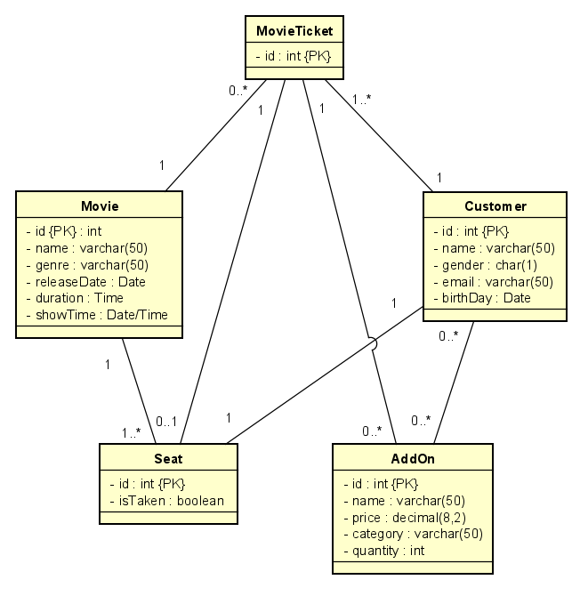

# SQL Design

## Table 1: Customer
### Attributes:
- customerID {PK}
- Name
- Email
- Gender
- Birthday
- movieTicketId // Foreign key references MovieTicket
- seatId // Foreign key references Seat
## Table 2: Movie
- MovieId {PK}
- Name
- Genre
- releaseDate
- duration
- showTime
## Table 3: MovieTicket
- ticketId {PK}
- customerId // Foreign key references customer
- movieId // Foreign key refernces 
## Table 4: Seat
- seatId {PK}
- isTaken
## Table 5: Add-Ons
- addOnId {PK}
- name
- price
- category
- quantity